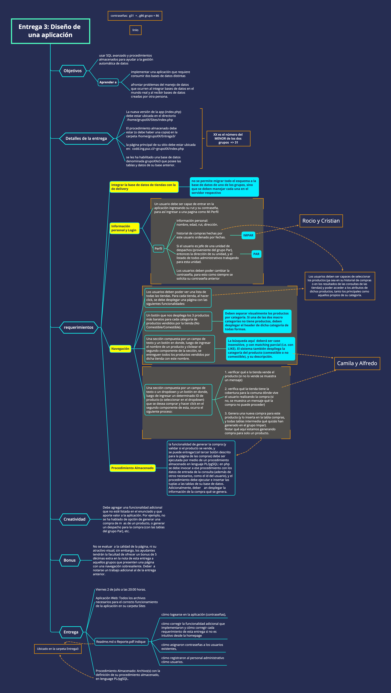

# Grupo 31 - Entrega 3

## Funcionalidad Adicional
Agregamos un link *Usuarios* en la barra de navegación que te lleva a toda la información de los usuarios registrados y un link *Productos* que te lleva a una lista de todos los productos ofrecidos donde al seleccionar el nombre, puedes ver sus especificaciones. Además, en la página de compras por tienda, en la sección de comprar un producto con su **id**, agregamos el nombre del producto asociado al **id** y agregamos la opción de seleccionar a cual de las direcciones asociadas al usuario en sesión  quiere que se le despache el producto.

## Requerimientos de la Entrega

### 3.1 Usuarios y Acceso
**Sistema de Usuarios**

Un usuario no registrado, al entrar a la página no puede seleccionar ningún link de la barra de navegación sin iniciar sesión o registrarse. Si selecciona otro link se le llevará a la página para iniciar sesión.

*Registración:* Un nuevo usuario puede registrarse apretando el link *Registrarse* en la barra de navegación donde debe entregar todos sus datos incluyendo su **dirección** y la **comuna** de la dirección. Una contraseña se le asignará aleatoriamente con las especificaciones planteadas en **Otros**. Si no completa algún campo, su **rut** ya se encuentra registrado, o su rut no tiene una estructura de siete u ocho números, con guión y luego un número o la letra **k**, la página le informará que hay un error en el registro, si no, iniciará sesión y agregará al usuario a la base de datos.

*Importación de usuarios:* En la tabla **Usuarios** de la base de datos del **grupo 31** se puede notar que todos los usuarios registrados con anterioridad tienen asignada una contraseña y que se ha agregado todo el personal administrativo de la base de datos del grupo Par. Los procedimientos almacenados utilizados se encuentran en la carpeta **Entrega 3**.

*Información personal y Login:* En la página **Perfil** a la cual se accede a través de la barra de navegación una vez que hay un usuario con sesión iniciada, se puede ver la información personal del usuario, su historial de compras y puede seleccionar la opción de cambiar su contraseña. Además, si el usuario registrado es jefe de una unidad de despachos, la dirección mostrada es la dirección de su unidad, y al final de la página se encuentra un listado de todos los administrativos trabajando para la unidad.

### 3.2 Navegación 

*Página de Compras:* Se puede acceder a la página de compras una vez iniciada la sesión. Aquí se encuentra en primera instancia una lista de todas las tiendas que tiene la página y al seleccionar alguna apretando su nombre, se va a otra página con 3 distintas secciones. La primera despliega los 3 productos más baratos para cada categoría de productos, la segunda da la opción de buscar algún producto por nombre en la tienda y la última permite realizar una compra unitaria a la tienda.

*Página de Productos:* Los usuarios pueden ver las especificaciones de un producto en todos los resultados de las consultas de las tiendas y también desde la página **Productos** seleccionando su nombre.

## Otros

* A la tabla usuarios de la base de datos del grupo 31 se le agregó una columna de direcciones (con la función cambio_usuarios en la carpeta **Entrega 3**), en la cual los usuarios que tenian más de una dirección, tienen asociada solo la dirección con menor id de las anteriores. 

 * Las contraseñas son números aleatorios asignados entre el 100000000 y 999999999. Además, si un usuario desea cambiar su contraseña debe ser un número entre los anteriores.

## Usuarios Registrados

|     Rut    | Contraseña |
|:----------:|:----------:|
| 18167947-6 | 1111111123 |
| 72810804-5 | 357924316  |
| 44253237-0 | 679108426  |
| 45026478-4 | 613075695  |
| 75576764-6 | 520193221  |
| 64879120-8 | 145555646  |
| 69373271-9 | 654249324  |
| 10517073-4 | 586921270  |
| 98708700-5 | 135237797  |
| 58945079-5 | 670224896  |
| 75270010-9 | 458600910  |
| 98683815-5 | 472810866  |
| 72939187-5 | 413791774  |
| 20297901-7 | 616465462  |
| 77209293-8 | 599433832  |
| 18665525-7 | 540788408  |
| 50062649-6 | 933757130  |
| 85973291-7 | 432252435  |
| 51153844-0 | 495925227  |
| 54076655-k | 300381362  |
| 94821886-0 | 337797573  |
| 36552322-3 | 120298232  |
| 32366948-1 | 890999230  |
| 77477421-1 | 944185940  |
| 13572944-2 | 715619110  |
| 79725605-6 | 712468392  |
| 66183219-3 | 922197075  |
| 40675138-4 | 641790172  |
| 23000993-7 | 819607203  |
| 88198898-4 | 438278656  |
| 66199185-2 | 389614432  |
| 16008678-5 | 543114321  |
| 36625090-5 | 696202971  |
| 87813399-4 | 968722858  |
| 93900888-8 | 156190017  |
| 30862862-0 | 216396193  |
| 43922451-7 | 114278505  |
| 95520055-1 | 710439341  |
| 75016224-k | 703317463  |
| 76591179-6 | 149516302  |
| 87081187-k | 380664238  |
| 36081017-8 | 161918374  |
| 80291272-2 | 522327168  |
| 37200573-4 | 694456012  |
| 56535213-k | 678383836  |
| 77796005-9 | 121761001  |
| 40350724-5 | 235244421  |
| 56499633-5 | 612140967  |
| 23526948-1 | 454013436  |
| 86664654-6 | 631169648  |
| 52916249-9 | 812522329  |
| 62785039-5 | 691811010  |
| 22145359-k | 651467881  |
| 63951440-4 | 703521560  |
| 97004364-0 | 635996951  |
| 47666047-5 | 367086992  |
| 88730119-0 | 415989953  |
| 53211068-8 | 558194027  |
| 14046488-0 | 908877164  |
| 31706054-8 | 235597157  |
| 23298212-8 | 896472683  |
| 57836259-2 | 298491597  |
| 97657967-4 | 678711478  |
| 59814228-9 | 592675656  |
| 89336201-0 | 267214456  |
| 94432090-3 | 734901495  |
| 92170041-5 | 709071849  |
| 64272663-3 | 281492961  |
| 91790173-2 | 445340838  |
| 45467235-6 | 412389314  |
| 99075946-4 | 331009264  |
| 96392316-3 | 726005075  |
| 73342699-3 | 474307687  |
| 47865441-3 | 753336432  |
| 88772168-8 | 420461088  |
| 87861767-3 | 152691525  |
| 41361801-0 | 775097433  |
| 31092780-5 | 555705509  |
| 11750224-4 | 664832491  |
| 72070561-3 | 229110871  |
| 51693674-6 | 186875159  |
| 92365268-k | 477354822  |
| 55776079-2 | 820921881  |
| 83296811-0 | 738343039  |
| 23713134-7 | 180876383  |
| 70624789-0 | 456918833  |
| 79425659-4 | 105430032  |
| 66258468-1 | 496866336  |
| 35662780-6 | 915112860  |
| 40403791-9 | 914307197  |
| 79480331-5 | 632463493  |
| 86646016-7 | 811585545  |
| 21666289-k | 212798795  |
| 52703981-9 | 311174972  |
| 83603309-4 | 404261202  |
| 47326835-3 | 380013250  |
| 49337371-4 | 946076468  |
| 87442136-7 | 113333052  |
| 48679409-7 | 561506211  |
| 36259502-9 | 391417306  |
| 29646441-4 | 425722366  |
| 33402225-0 | 792515475  |
| 95855049-9 | 117422383  |
| 51755919-9 | 800030053  |
| 49993665-6 | 545851908  |
| 69141385-3 | 437883472  |
| 33481996-5 | 852721578  |
| 68505645-3 | 320949343  |
| 47067447-4 | 893588981  |
| 58557550-k | 517554071  |
| 27650119-4 | 450060214  |
| 18812547-6 | 980464140  |
| 66625711-1 | 894908893  |
| 52189199-8 | 270982096  |
| 28012525-3 | 718807180  |
| 48795285-0 | 975785276  |
| 89321752-5 | 627900928  |
| 35066595-1 | 724237212  |
| 42621036-3 | 472651614  |
| 66954467-7 | 543013790  |
| 18446690-2 | 638544410  |
| 65227086-7 | 105115108  |
| 35661237-k | 354599336  |
| 67913619-4 | 751343205  |
| 83290634-4 | 316290080  |
| 62014673-0 | 658860538  |
| 92311983-3 | 131356456  |
| 59517619-0 | 262366549  |
| 42655208-6 | 672193590  |
| 65573855-k | 592862668  |
| 62420431-k | 553783856  |
| 56064569-4 | 997915956  |
| 94422835-7 | 385378144  |
| 35668656-k | 571206239  |
| 95437335-5 | 797946010  |
| 63532763-4 | 831230053  |
| 46680387-1 | 909089711  |
| 85297873-2 | 650667589  |
| 88132030-4 | 152179397  |
| 39473167-6 | 802678693  |
| 58154631-9 | 168221661  |
| 38830395-6 | 502239610  |
| 36030482-5 | 783142834  |
| 95667888-9 | 963130554  |
| 97996738-1 | 673221706  |
| 96007294-4 | 501950015  |
| 52176953-k | 938915831  |
| 59332921-6 | 301122635  |
| 23298314-0 | 226187228  |
| 31113786-7 | 411567446  |
| 87991170-2 | 744136425  |
| 87631642-0 | 764731638  |
| 17509928-k | 416682554  |
| 53089483-5 | 998735761  |
| 75523496-6 | 516074844  |
| 87734759-1 | 632972635  |
| 34424260-7 | 657596300  |
| 66920820-0 | 547431300  |
| 93057304-3 | 795339184  |
| 82673938-k | 329789891  |
| 14920531-4 | 140293969  |
| 96260856-6 | 349123041  |
| 86103635-9 | 327705847  |
| 94384917-k | 425672113  |
| 47329036-7 | 820329280  |
| 44867899-7 | 125651859  |
| 32690774-k | 256902167  |
| 10544563-6 | 729418992  |
| 28485302-4 | 676319448  |
| 63214394-k | 309081564  |
| 36044904-1 | 532097686  |
| 10206801-7 | 744541109  |
| 34566442-4 | 711321174  |
| 65238271-1 | 315240521  |
| 54230570-3 | 707671664  |
| 76871405-3 | 384542881  |
| 38204359-6 | 717190536  |
| 33456182-8 | 646587496  |
| 75806614-2 | 585665516  |
| 19844189-9 | 843377764  |
| 70735043-1 | 958154942  |
| 64221026-2 | 329801943  |
| 50453382-4 | 608109404  |
| 87649058-7 | 374837497  |
| 75153238-5 | 328537705  |
| 12348490-8 | 124184249  |
| 92445451-2 | 907810131  |
| 49604231-k | 886134005  |
| 35288330-1 | 571615549  |
| 90870389-8 | 703149317  |
| 52157315-5 | 215923897  |
| 35820841-k | 611909518  |
| 66361406-1 | 952272358  |
| 20843742-9 | 443629744  |
| 78059417-9 | 937581631  |
| 98417733-k | 772601639  |
| 59170372-2 | 469281603  |
| 25070905-6 | 194483799  |
| 60370162-3 | 502020633  |
| 54982068-9 | 145601052  |
| 66336340-9 | 403565363  |
| 35685353-9 | 934118319  |
| 97102977-3 | 790142161  |
| 58155861-9 | 114886538  |
| 42168093-0 | 249358841  |
| 59885368-1 | 497813826  |
| 61554580-5 | 399429419  |
| 66646618-7 | 866549377  |
| 15298663-7 | 144401323  |
| 62778278-0 | 885094935  |
| 38287473-0 | 709927142  |
| 11644968-4 | 102556266  |
| 97781705-6 | 214896878  |
| 80611905-9 | 318036547  |
| 97343582-5 | 377393763  |
| 79693636-3 | 443434583  |
| 69140468-4 | 342220795  |
| 48925896-k | 285203895  |
| 20640357-8 | 329568589  |
| 33016426-3 | 813836344  |
| 56790702-3 | 888353212  |
| 45276568-3 | 445492486  |
| 20335324-3 | 425745863  |
| 42226798-0 | 840625571  |
| 43129309-9 | 789122231  |
| 26905798-k | 363327496  |
| 91119340-k | 613227211  |
| 77625718-4 | 258403835  |
| 81698647-8 | 457811295  |
| 15333675-k | 115247844  |
| 61993529-2 | 304004887  |
| 22060310-5 | 761376659  |
| 77520112-6 | 949366163  |
| 75346943-5 | 994147048  |
| 62550748-0 | 776263196  |
| 77814675-4 | 198725005  |
| 64370666-0 | 491960874  |
| 28752611-3 | 175692616  |
| 74644456-7 | 965274383  |
| 37500745-2 | 536362198  |
| 56119224-3 | 960787551  |
| 59919311-1 | 675201526  |
| 11087572-k | 538918463  |
| 12033288-0 | 175684431  |
| 49891081-5 | 893238073  |
| 55705480-4 | 816312227  |
| 98642893-3 | 519119014  |
| 49255740-4 | 235458869  |
| 63360085-6 | 101516123  |
| 26257768-6 | 748687603  |
| 17474518-8 | 949295213  |
| 65884381-8 | 889869335  |
| 47287276-1 | 194180091  |
| 33078552-7 | 375041078  |
| 48776848-0 | 730494907  |
| 16222268-6 | 883302321  |
| 95226644-6 | 638368574  |
| 17723136-3 | 343722119  |
| 83584289-4 | 141706157  |
| 92554015-3 | 996179869  |
| 48345899-1 | 358969964  |
| 49036882-5 | 345711044  |
| 96964691-9 | 757556529  |
| 16775393-0 | 308336128  |
| 51242629-8 | 339858093  |
| 88806288-2 | 533819726  |
| 57289805-9 | 407061134  |
| 49860637-7 | 731818968  |
| 27844046-k | 609512343  |
| 45504619-k | 372335518  |
| 73453102-2 | 268181166  |
| 84569598-9 | 570299895  |
| 94688326-3 | 947537044  |
| 84078768-0 | 707099630  |
| 91223172-0 | 645984325  |
| 51317447-0 | 840775118  |
| 78463527-9 | 523411858  |
| 46025545-7 | 165103341  |
| 40424433-7 | 976233987  |
| 68428477-0 | 524927981  |
| 28630079-0 | 813790944  |
| 63824003-3 | 925529201  |
| 58307021-4 | 414797317  |
| 77983700-9 | 907971035  |
| 57189229-4 | 300570280  |
| 41581842-4 | 145292226  |
| 55106753-k | 791273357  |
| 19735595-6 | 838938854  |
| 45024924-6 | 389014345  |
| 63884576-8 | 832979515  |
| 61262323-6 | 835118724  |
| 24129722-5 | 647984309  |
| 39567466-8 | 178690560  |
| 94888169-1 | 592675254  |
| 31642814-2 | 856320438  |
| 79195789-3 | 418548653  |
| 56292778-6 | 126494981  |
| 33670116-3 | 263381573  |
| 48040287-1 | 150367622  |
| 14761964-2 | 636007324  |
| 27712443-2 | 535717091  |
| 51853396-7 | 318548788  |
| 23711490-6 | 206307220  |
| 53523140-0 | 483254136  |
| 49974632-6 | 925648418  |
| 95598580-k | 752291546  |
| 49798131-k | 324029254  |
| 71591727-0 | 449060277  |
| 30760014-5 | 817394886  |
| 33904341-8 | 300263242  |
| 78331019-8 | 873988258  |
| 64903395-1 | 631185832  |
| 45125749-8 | 225792444  |
| 81498697-7 | 288785576  |
| 78599189-3 | 539156867  |
| 85682952-9 | 426362724  |
| 47738259-2 | 334077802  |
| 48425773-6 | 330430226  |
| 82645956-5 | 265301579  |
| 55956975-5 | 623092147  |
| 99875339-2 | 163409742  |
| 29858450-6 | 100420304  |
| 74759859-2 | 271076457  |
| 46012714-9 | 242100302  |
| 43630930-9 | 593095558  |
| 56425505-k | 127396895  |
| 16239796-6 | 560648955  |
| 10165029-4 | 619590539  |
| 82809947-7 | 290778468  |
| 37492390-0 | 611016577  |
| 87544765-3 | 255597864  |
| 97901764-2 | 726495559  |
| 99294258-4 | 829565366  |
| 48060937-9 | 361905084  |
| 85411178-7 | 209749695  |
| 10959343-5 | 755213786  |
| 74630833-7 | 114196631  |
| 20909860-1 | 433778950  |
| 23748548-3 | 204274064  |
| 25572424-k | 831591517  |
| 75653640-0 | 634042192  |
| 49359132-0 | 978262322  |
| 50270274-2 | 462777349  |
| 46080300-4 | 759834636  |
| 99265623-9 | 267047900  |
| 75039658-5 | 901934217  |
| 79735673-5 | 186197362  |
| 34864642-7 | 501125702  |
| 38563658-k | 232364444  |
| 13463271-2 | 351498941  |
| 50109588-5 | 124217850  |
| 44126502-6 | 295774185  |
| 73352137-6 | 351919246  |
| 70156418-9 | 295294307  |
| 96557795-5 | 437874487  |
| 76413818-k | 845014804  |
| 66119831-1 | 322691203  |
| 81600879-4 | 898523442  |
| 69698793-9 | 464605344  |
| 91888069-0 | 513469671  |
| 73075290-3 | 509540021  |
| 95932617-7 | 620203208  |
| 69402733-4 | 239965231  |
| 67391164-1 | 339105387  |
| 81492646-k | 882108293  |
| 25342278-5 | 799112840  |
| 37981852-8 | 691283829  |
| 14156767-5 | 475588387  |
| 17341224-k | 503660162  |
| 33461512-k | 628231405  |
| 65175008-3 | 561234598  |
| 95656123-k | 739593459  |
| 60854678-2 | 935604219  |
| 29676675-5 | 858908383  |
| 64268937-1 | 567992714  |
| 13938471-7 | 856039847  |
| 60158787-4 | 324684616  |
| 45751112-4 | 367965490  |
| 75910499-4 | 887820046  |
| 22532060-8 | 446876839  |
| 44973013-5 | 413790235  |
| 96332059-0 | 347849966  |
| 44380500-1 | 815537490  |
| 62820832-8 | 777590062  |
| 42814101-6 | 744632559  |
| 17459269-1 | 161320661  |
| 52778909-5 | 671047651  |
| 48007583-8 | 292056058  |
| 54546935-9 | 877619136  |
| 61514910-1 | 365701843  |
| 36918308-7 | 445050341  |
| 16697747-9 | 756412930  |
| 83029887-8 | 524227062  |
| 59537115-5 | 771580434  |
| 95199785-4 | 313064776  |
| 44171043-7 | 127086089  |
| 42679613-9 | 570693276  |
| 25327705-k | 904348605  |
| 66284985-5 | 502674476  |
| 59445067-1 | 974353438  |
| 25696685-9 | 532580011  |
| 82533150-6 | 963909075  |
| 58963604-k | 713946898  |
| 35806868-5 | 468184231  |
| 11118739-8 | 822817458  |
| 61995722-9 | 281939613  |
| 22479749-4 | 324224079  |
| 20032612-1 | 147502075  |
| 29728267-0 | 549905103  |
| 97166191-7 | 212044126  |
| 79446327-1 | 494378914  |
| 23648509-9 | 863695338  |
| 26113418-7 | 459894092  |
| 60987426-0 | 309916405  |
| 99748016-3 | 641285401  |
| 60517573-2 | 204526652  |
| 48269008-4 | 371237067  |
| 18969557-8 | 312333054  |
| 33461543-k | 396582710  |
| 58812264-6 | 248856204  |
| 54178021-1 | 578034897  |
| 67314332-6 | 741633051  |

## Workmap

